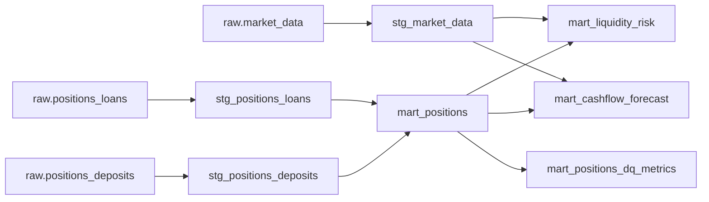

# dbt project reference

Project root:

- https://github.com/beauschwab/airflow-dbt-datahub/blob/main/dbt/liquidity_analytics/dbt_project.yml

## Model graph

## Partitioning

- Most models partition on `partition_date`
- `mart_positions` partitions on both `partition_date` and `source_system`

## Data Quality

- Generic + singular tests live under https://github.com/beauschwab/airflow-dbt-datahub/tree/main/dbt/liquidity_analytics/tests
- Aggregation threshold metrics are materialized in `mart_positions_dq_metrics`
